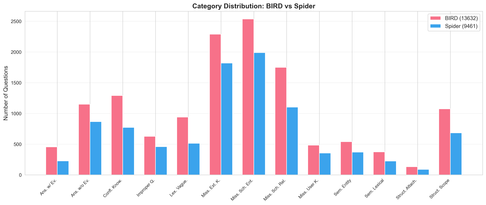
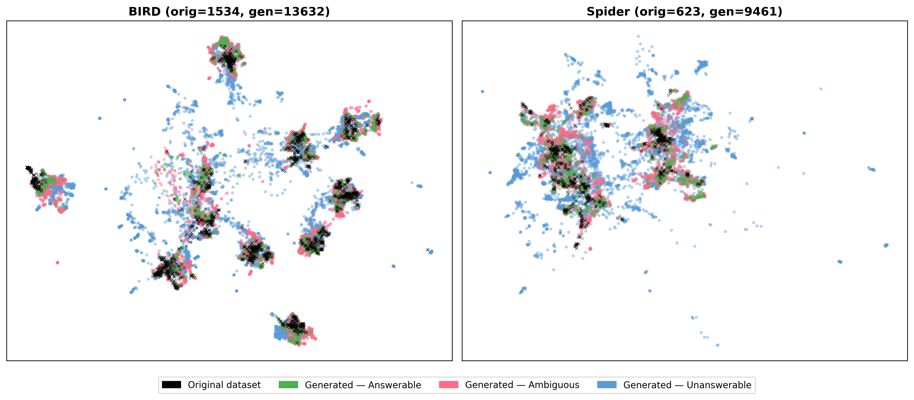
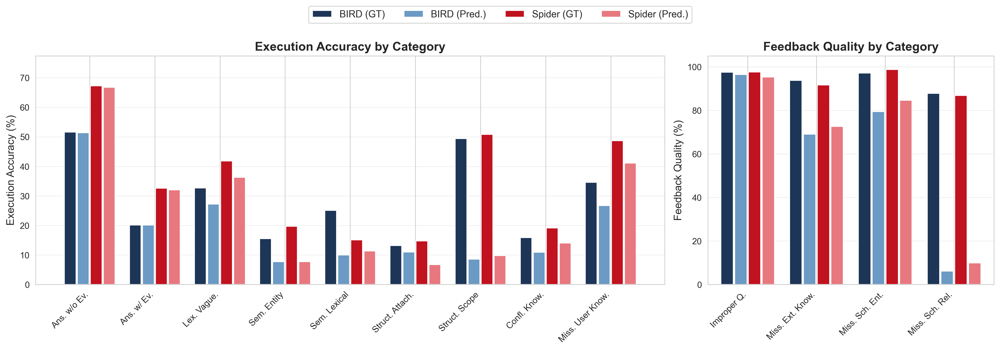

# ABISS: Evaluating Text-to-SQL Systems Through Agent Interaction


A comprehensive framework for evaluating text-to-SQL systems on ambiguous and unanswerable questions through multi-turn agent interaction.

<!-- [Paper Link](#) -->

## Overview

Large Language Models demonstrate high performance on curated text-to-SQL benchmarks, yet real-world users frequently pose ambiguous or unanswerable questions that current systems handle poorly. This repository provides three interconnected contributions:

1. **A unified taxonomy** of 8 categories (13 subcategories) covering ambiguous and unanswerable questions for knowledge-augmented text-to-SQL systems
2. **A multi-agent generation pipeline** that produces natural language questions from arbitrary databases, validated by a council of local open-source models
3. **ABISS** (Ambiguity Benchmark using Interaction-Simulated Sessions), a dynamic simulation environment where text-to-SQL agents interact with style-aware simulated users across multi-turn dialogues

## Taxonomy

The taxonomy organizes questions into three groups based on answerability:

| Group | Category | Subcategory | Description |
|-------|----------|-------------|-------------|
| **Answerable** | Answerable | Without Evidence | Directly answerable from the database schema |
| | | With Evidence | Answerable using provided external evidence |
| **Ambiguous** | Structural Ambiguity | Scope Ambiguity | Unclear quantifier scope ("each", "every", "all") |
| | | Attachment Ambiguity | Unclear modifier attachment in conjunctions |
| | Semantic Mapping Ambiguity | Lexical Overlap | Two or more schema attributes share similar or identical forms |
| | | Entity Ambiguity | Terms map to attributes in different entities |
| | Lexical Vagueness | | Vague terms lacking precise boundaries ("recent", "high") |
| | Missing User Knowledge | | User-specific context required ("my department") |
| | Conflicting Knowledge | | Non-equivalent pieces of evidence in the knowledge base |
| **Unanswerable** | Missing Schema Elements | Missing Entities or Attributes | Required tables or columns absent from schema |
| | | Missing Relationship | No linkage exists between relevant entities |
| | Missing External Knowledge | | Domain-specific facts or policies not in database or knowledge base |
| | Improper Question | | Unrelated to the domain, or not a database query |

## Installation

### Requirements

- Python 3.10+
- CUDA-capable GPU (for vLLM inference)
- Sufficient disk space for model weights

### Setup

```bash
# Clone the repository
git clone <repository-url>
cd taxonomy

# Install dependencies
pip install -r requirements.txt

# Install vLLM (for model inference)
pip install vllm
```

## Quick Start

### Question Generation

Generate benchmark questions across all categories, styles, and difficulty levels:

```bash
# Generate questions for BIRD
python do_question_generation.py \
    --db_name bird_dev \
    --db_root_path datasets/bird_dev/dev_databases \
    --model_names models/Qwen2.5-32B-Instruct models/Mistral-Small-3.2-24B-Instruct-2506 models/gemma-3-27b-it \
    --n_samples 3 \
    --tensor_parallel_size 2 \
    --intermediate_results_folder results/intermediate_results \
    --output_path results/question_generation/generated_questions.json \
    --verbose

# Generate questions for Spider
python do_question_generation.py \
    --db_name spider_test \
    --db_root_path datasets/spider_test/test_databases \
    --model_names models/Qwen2.5-32B-Instruct models/Mistral-Small-3.2-24B-Instruct-2506 models/gemma-3-27b-it \
    --n_samples 3 \
    --tensor_parallel_size 2 \
    --intermediate_results_folder results/intermediate_results \
    --output_path results/question_generation/spider_questions.json \
    --verbose
```

**Generation Parameters:**

| Parameter | Description |
|-----------|-------------|
| `--db_name` | Name identifier for the database set |
| `--db_root_path` | Root directory containing database folders |
| `--model_names` | LLM model paths for generation (space-separated, used as council) |
| `--n_samples` | Number of questions to generate per category per model |
| `--tensor_parallel_size` | Number of GPUs for tensor parallelism |
| `--categories` | Specific categories to generate (omit for all). See [Custom Taxonomy Guide](CUSTOM_TAXONOMY.md) for the full list |
| `--styles` | Question styles: `formal`, `colloquial`, `imperative`, `interrogative`, `descriptive`, `concise` |
| `--difficulties` | Difficulty levels: `simple`, `moderate`, `complex`, `highly_complex` |
| `--db_ids` | Specific database IDs to use (omit for all databases in root) |
| `--quantization` | Quantization method: `bitsandbytes`, `fp8`, `awq`, `gptq` |
| `--limit_categories` | Only use specified categories for validation (not the full taxonomy) |
| `--intermediate_results_folder` | Save intermediate results for debugging |

### Interactive Benchmarking

Evaluate text-to-SQL systems on generated questions with simulated user interactions:

```bash
python do_interaction.py \
    --db_name bird_dev \
    --db_root_path datasets/bird_dev/dev_databases \
    --model_names models/Qwen2.5-32B-Instruct models/Mistral-Small-3.2-24B-Instruct-2506 models/gemma-3-27b-it \
    --system_model models/Qwen2.5-32B-Instruct \
    --tensor_parallel_size 2 \
    --question_path results/question_generation/generated_questions.json \
    --output_path results/interaction/bird_interactions.json \
    --verbose
```

**Interaction Parameters:**

| Parameter | Description |
|-----------|-------------|
| `--db_name` | Name identifier for the database set |
| `--db_root_path` | Root directory containing database folders |
| `--question_path` | Path to JSON file with generated questions |
| `--model_names` | LLM model paths for the user simulation council (space-separated) |
| `--system_model` | Model to evaluate as the text-to-SQL system (if not specified, each model in `--model_names` is evaluated) |
| `--tensor_parallel_size` | Number of GPUs for tensor parallelism |
| `--max_steps` | Maximum clarification turns before forced final response (default: 3) |
| `--category_uses` | Category usage modes to test: `ground_truth`, `predicted`, `no_category` |
| `--balanced` | Balance the evaluation dataset for equal group representation |
| `--balance_by` | Balance by `category` (13-way) or `group` (3-way: answerable, ambiguous, unanswerable) |
| `--db_ids` | Specific database IDs to use (omit for all) |

## Key Features

### Multi-Dimensional Question Generation
Questions are generated with fine-grained control over category (13 subcategories), linguistic style (6 styles), and difficulty level (4 levels), producing a diverse benchmark across any database.

### Council-Based Validation
Generated questions pass through a 10-stage validation pipeline where a council of LLMs votes on quality decisions via majority voting, reducing single-model bias:
1. Duplicate Removal
2. SQL Executability
3. Ground Truth Satisfaction
4. Evidence Necessity
5. Ambiguity Verification
6. Unsolvability Verification
7. Feedback Quality Check
8. Category Consistency
9. Difficulty Conformance
10. Style Conformance

### Interactive Simulation
The benchmark simulates realistic multi-turn dialogues where:
- The **system agent** classifies questions, generates SQL, asks clarifications, or provides feedback
- The **user agent** (council of LLMs) responds with style-aware answers, assessed for relevancy via majority voting
- Three **category usage modes** isolate different capabilities: ground truth (interaction only), predicted (end-to-end), no category (fully autonomous)

### Efficient Batched Inference
The framework leverages vLLM for high-performance inference with batched generation, prefix caching, tensor parallelism, and configurable quantization.

## Evaluation Metrics

| Metric | Scope | Description |
|--------|-------|-------------|
| **Recognition** | All questions | Does the system correctly identify the question type (answerable, ambiguous, or unanswerable)? |
| **Classification** | All questions | Exact subcategory matching between the ground truth and the system's prediction |
| **Execution Accuracy** | Answerable and ambiguous | Does the generated SQL produce semantically equivalent results to the ground truth? |
| **Feedback Accuracy** | Unanswerable | Does the system's explanation match the question's hidden knowledge? Assessed by council voting. |
| **Turns to Relevant (TTR)** | Ambiguous (with clarifications) | Number of system turns before the first relevant clarification question |
| **Turns to Stop (TTS)** | Ambiguous (with clarifications) | Number of turns from the first relevant clarification to the terminal response |

## Results

### Generated Datasets

The generation pipeline produced two datasets: **ABISS-BIRD** (13,632 questions across 11 databases) and **ABISS-Spider** (9,461 questions across 11 databases), totaling 23,093 validated questions.

<p align="center">
  
</p>

<p align="center">
  
</p>

### Overall Benchmark Results

Seven open-source models (7B to 70B parameters) were evaluated under the Predicted and Ground Truth (in parentheses) category modes on balanced subsets (BIRD: 4,809 questions; Spider: 3,276 questions):

| Model | Size | | ABISS-BIRD | | | | ABISS-Spider | | |
|-------|------|---|---|---|---|---|---|---|---|
| | | **Rec.** | **Cls.** | **EX** | **FB** | **Rec.** | **Cls.** | **EX** | **FB** |
| Llama-3.3-70B | 70B | 67.7 | 57.9 | 28.1 (40.0) | 61.8 (93.0) | 72.5 | 65.3 | 39.8 (51.5) | 70.7 (90.7) |
| Qwen2.5-Coder-32B | 32B | 69.1 | 56.5 | 28.2 (39.0) | 62.3 (90.5) | 72.0 | 59.1 | 38.4 (49.2) | 69.7 (91.0) |
| Qwen2.5-32B | 32B | 68.7 | 63.4 | 29.6 (40.9) | 65.1 (94.1) | 73.3 | 67.5 | 38.0 (49.4) | 72.8 (94.7) |
| Gemma-3-27B | 27B | 62.0 | 45.0 | 23.2 (33.3) | 61.3 (95.0) | 64.7 | 46.5 | 33.2 (44.1) | 68.6 (93.6) |
| **Mistral-Small-24B** | **24B** | **69.1** | **63.7** | **29.9 (41.6)** | **65.4 (95.3)** | **74.7** | **69.2** | **43.6 (56.0)** | **73.9 (95.9)** |
| Llama-3.1-8B | 8B | 41.3 | 20.6 | 14.1 (26.2) | 21.5 (89.3) | 42.9 | 20.1 | 21.8 (36.3) | 26.1 (92.0) |
| Qwen2.5-7B | 7B | 59.4 | 41.4 | 18.4 (29.3) | 55.1 (89.9) | 61.5 | 42.4 | 27.3 (39.7) | 59.9 (91.1) |

### Impact of Category Knowledge

Average performance across all seven models under each category usage mode:

| | Mode | EX | FB |
|------|------|------|------|
| BIRD | Ground Truth | 35.8 | 92.4 |
| | Predicted | 24.2 | 56.2 |
| | No Category | 25.1 | 49.2 |
| Spider | Ground Truth | 46.6 | 92.7 |
| | Predicted | 34.1 | 63.2 |
| | No Category | 34.2 | 55.0 |

### Per-Category Performance

<p align="center">
  
</p>

### Key Findings

- **Subcategory classification is the bottleneck**: models reliably detect that a question is problematic (Recognition) yet struggle to pinpoint the specific subcategory (Classification), with a 5 to 23 percentage-point gap.
- **Feedback is classification-bounded**: feedback accuracy jumps from 49.2% to 92.4% on BIRD when ground truth categories are provided, indicating that models can almost always generate correct explanations once they know the exact problem type.
- **SQL integration remains fundamentally difficult**: even under oracle conditions (ground truth category, relevant clarifications received), the best execution accuracy reaches only 41.6% on BIRD and 56.0% on Spider.
- **Model size does not predict performance**: Mistral-Small-24B (24B) achieves the highest scores despite being smaller than Llama-3.3-70B and both 32B models, suggesting that training data composition matters more than scale.

## Extending ABISS

ABISS is designed to be extended with custom question categories and new databases:

- **[Custom Taxonomy Guide](CUSTOM_TAXONOMY.md)**: How to create new question categories, define their output schemas, and plug them into the generation and interaction pipelines
- **[Database Setup Guide](DATABASE_SETUP.md)**: How to organize and add new databases for question generation and benchmarking

## Project Structure

```
├── agents/              # System agent for classification and response generation
├── benchmarks/          # Interactive benchmarking orchestrator
├── categories/          # 13 question category definitions (taxonomy)
├── dataset_dataclasses/ # Data structures for questions and results
├── db_datasets/         # Database interface and schema management
├── evaluators/          # Evaluation metrics (recognition, classification, execution, feedback)
├── generators/          # Question generation pipeline
├── models/              # LLM interfaces (vLLM)
├── users/               # Simulated user agent for benchmarking
├── validators/          # 10-stage validation pipeline
├── utils/               # Utility functions
├── do_question_generation.py  # Entry point: question generation
├── do_interaction.py          # Entry point: interactive benchmarking
├── generate_result_charts.py  # Analysis: performance charts
└── generate_confusion_matrix.py # Analysis: confusion matrices
```

For detailed file-by-file documentation, see [PROJECT_STRUCTURE.md](PROJECT_STRUCTURE.md).

## Citation

If you use this code or dataset in your research, please cite:

```bibtex
@article{Sullutrone2026ABISS,
  author    = {Sullutrone, Giovanni and Bergamaschi, Sonia},
  title     = {{ABISS}: Evaluating Text-to-{SQL} Systems Through Agent Interaction},
  journal   = {Proceedings of the VLDB Endowment},
  year      = {2026},
  volume    = {14},
  number    = {1}
}
```

## License

This project is licensed under the MIT License. See the [LICENSE](LICENSE) file for details.

## Contact

For questions or issues, please contact giovanni.sullutrone@unimore.it or open an issue on GitHub.
